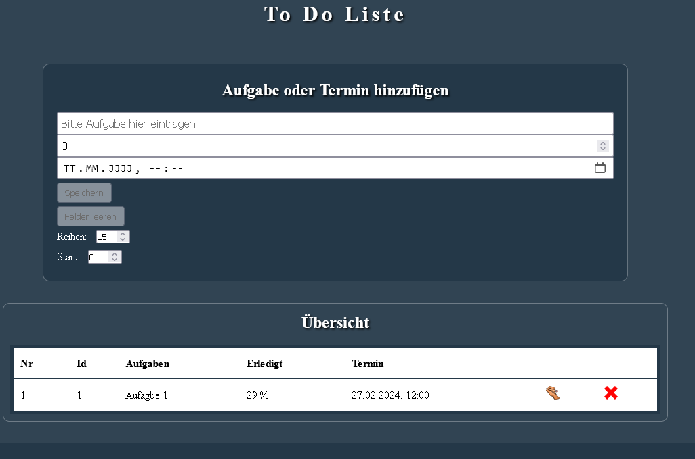

# toDoList-React-v3
 ToDoListe mit React erstellt und Speicherung in einer mysql Datenbank

Es können Aufgaben oder Termine eingefügt werden.
Bearbeitungsstand in % und Termin mit Uhrzeit

Config:
1. Import der DB aus _sql
2. php datei aus public in htdocs
3. Apache und sql Server starten

React:
Terminal:
1. npm install
2. npm run dev
3. Pfad zur PHP Datei anpassen falls nötig: src/assets/baseURL Vorgabe(http://localhost)

PHP:
Falls nötig (DATABASE CONFIGURATION) in der toDoData.php anpassen

